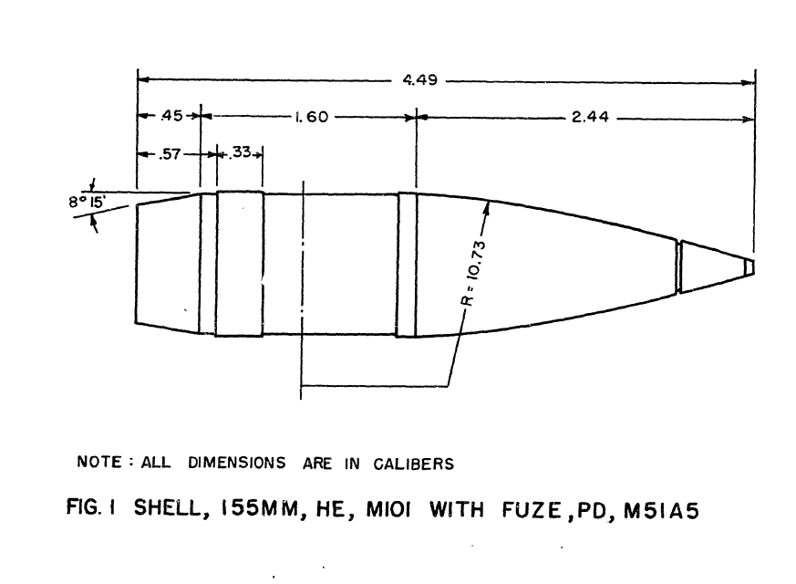

# Drag-coefficient-Kd-155-MM-SHELL
A Drag Coefficient (Kᴅ) Based on the 155 mm Shell, HE, M101

Este repositório cria um grafico Kd x Mach de um projétil **155 mm (HE, M101)** na **faixa transônica**, a partir de **medições experimentais** e **ajustes por polinômios**.

O objetivo aqui é **documentar o problema de modelagem aerodinâmica** (arrasto vs. Mach) e o tratamento matemático dos dados, evitando qualquer conteúdo operacional.

Para isso, coeficientes de arrasto **Kᴅ** obtidos de medições na faixa transônica do **M101** (considerado similar ao M107, com diferença principal associada à faixa/anel de rotação mais largo) foram **ajustados por uma série de polinômios**. 

---

## O que é Kᴅ 

**Kᴅ** é o coeficiente/termo de arrasto utilizado no modelo balístico do relatório, tratado como função do **número de Mach** na região transônica, onde o arrasto varia de forma intensa e não linear.

  
---

## Aviso de uso responsável

Este repositório tem finalidade **técnico-acadêmica** (modelagem de arrasto e ajuste de curvas). 

Não se destina a orientar uso, operação ou otimização de sistemas de armamento, e deve respeitar legislação e políticas aplicáveis.

